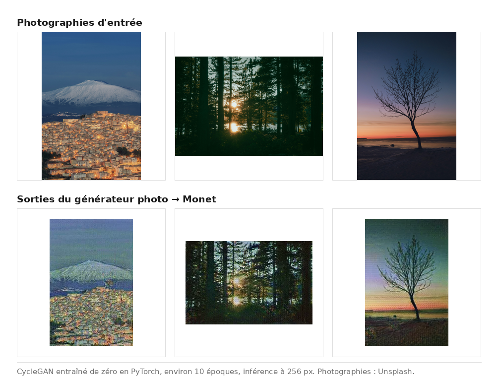

# Monet CycleGAN · Transfert de style non apparié entre photographie et peinture

> Implémentation en PyTorch d'un CycleGAN entraîné à traduire des photographies en peintures dans le style de Monet, et inversement, sans aucune paire d'images correspondantes. Le dépôt contient le code d'entraînement complet et une démonstration web interactive.


<p align="center">
  
</p>

---

## Le problème

Le transfert de style entre deux domaines visuels se résout facilement quand on dispose de paires alignées : une même scène photographiée et peinte, pixel à pixel. Ces paires n'existent pas. Monet est mort en 1926, personne ne peut photographier ce qu'il a peint, et aucun peintre ne reproduira à l'identique des milliers de photographies.

Le CycleGAN contourne cette impossibilité. Plutôt que d'apprendre une correspondance image par image, il apprend deux distributions séparément, puis une transformation réversible entre elles. L'idée centrale est la contrainte de cohérence de cycle : si une photo est convertie en peinture puis reconvertie en photo, on doit retrouver l'image de départ. C'est cette contrainte, et non des paires étiquetées, qui empêche le générateur de produire n'importe quelle image plausible du domaine cible.

---

## Architecture

Le système repose sur quatre réseaux entraînés simultanément.

| Réseau | Rôle |
|---|---|
| `gen_A` | photographie → peinture Monet |
| `gen_B` | peinture Monet → photographie |
| `disc_A` | distingue les vraies peintures des peintures générées |
| `disc_B` | distingue les vraies photographies des photographies générées |

### Générateur

Auto-encodeur convolutif de type ResNet, conforme au papier original :

```
Conv 7x7 (3 → 64)
  ↓ deux blocs de compression, stride 2   (64 → 128 → 256)
  ↓ neuf blocs résiduels à 256 canaux     ← la transformation de domaine
  ↓ deux blocs de reconstruction, ConvTranspose stride 2
Conv 7x7 (64 → 3) suivie d'une tanh
```

Le remplissage en mode `reflect` limite les artefacts de bord, et la normalisation par instance (`InstanceNorm2d`) plutôt que par lot est le choix standard en transfert de style : elle normalise chaque image indépendamment, ce qui convient à un entraînement avec une taille de lot de 1.

### Discriminateur

PatchGAN : au lieu d'émettre un unique score vrai ou faux pour l'image entière, il produit une carte de scores où chaque valeur juge une région locale. Le générateur est ainsi contraint d'être crédible partout, et pas seulement dans sa composition globale.

### Fonctions de coût

| Terme | Coefficient | Rôle |
|---|---|---|
| Adversarial | 1 | tromper le discriminateur |
| Cohérence de cycle | `LAMBDA_CYCLE = 10` | garantir que l'aller-retour restitue l'image d'origine |
| Identité | `LAMBDA_IDENTITY = 0.5` | laisser inchangée une image appartenant déjà au domaine cible |

Le terme d'identité stabilise les couleurs et évite les dérives chromatiques. Son effet est directement observable : passer une photographie dans `gen_B`, le générateur de photographies, la restitue presque telle quelle.

---

## Données

Jeu de données `monet2photo`, issu du dépôt officiel du papier CycleGAN : 6 287 photographies de paysages et un corpus de peintures de Claude Monet, sans aucune correspondance entre les deux ensembles.

Prétraitement : redimensionnement en 256 × 256, symétrie horizontale aléatoire, normalisation dans l'intervalle [-1, 1] via Albumentations.

Le script `dl.py` télécharge et décompresse automatiquement le jeu de données.

---

## Entraînement

| Paramètre | Valeur |
|---|---|
| Matériel | NVIDIA RTX 2060 Super, 8 Go de VRAM |
| Taille de lot | 1 |
| Résolution | 256 × 256 |
| Optimiseur | Adam, taux d'apprentissage 2e-4 |
| Précision mixte | activée (`torch.amp`, mise à l'échelle du gradient) |
| Durée par époque | environ 24 minutes |
| Époques effectuées | environ 10 |

**Les contraintes matérielles ont façonné le projet.** Avec 8 Go de VRAM, la taille de lot est nécessairement de 1 et la précision mixte devient indispensable pour tenir en mémoire. Les sessions longues étant exposées aux interruptions, un système de points de contrôle (`LOAD_MODEL`) permet de reprendre l'entraînement là où il s'était arrêté plutôt que de tout relancer.

Un point non trivial rencontré en cours de route : des plantages CUDA de type *illegal memory access* survenant après plusieurs heures, résolus en migrant vers l'API `torch.amp.GradScaler('cuda')` et `torch.amp.autocast('cuda')`, l'ancienne API `torch.cuda.amp` étant devenue instable.

---

## Résultats et analyse

Les images de la figure en tête de ce README ont été produites par le modèle à environ 10 époques, en inférence à 256 pixels.

**Ce qui fonctionne.** Les scènes naturelles donnent les meilleurs résultats : forêts en contre-jour, ciels, plans d'eau et végétation. Le modèle restitue une fragmentation de la lumière en touches courtes, caractéristique de l'impressionnisme, tout en préservant la structure de la scène.

**Ce qui échoue, et pourquoi.** La vue urbaine dense est mal traitée : le corpus de Monet est composé de paysages, de jardins et de scènes fluviales, quasiment sans agglomération vue de haut. C'est un cas hors distribution, et aucune quantité d'entraînement supplémentaire n'y remédierait sans élargir le corpus.

**Un artefact identifié.** Un motif en damier apparaît sur les zones de dégradé lisse, particulièrement visible dans les ciels de coucher de soleil. Sa cause est architecturale et documentée : les couches `ConvTranspose2d` du décodeur produisent des recouvrements inégaux entre le noyau et le pas de convolution. La correction connue consiste à remplacer la déconvolution par un suréchantillonnage suivi d'une convolution ordinaire.

**Sur l'évaluation.** Aucune métrique quantitative n'a été calculée. Les GAN se prêtent mal à une mesure unique, et l'inspection visuelle à intervalles réguliers reste la pratique courante. Une évaluation rigoureuse passerait par un FID entre les images générées et le corpus de peintures réelles.

---

## Démonstration interactive

Une interface web permet de déposer une photographie et d'obtenir son interprétation picturale.

```bash
pip install -r requirements.txt
python app.py
```

L'interface s'ouvre sur `http://127.0.0.1:7860`.

Elle expose un curseur de résolution de traitement, rendu possible par le caractère entièrement convolutif du générateur : le réseau accepte n'importe quelle taille d'entrée divisible par 4. Au-delà de la résolution d'entraînement, l'image gagne en détail mais la texture picturale s'atténue, la taille des coups de pinceau appris restant fixe en pixels.

Les poids du modèle ne sont pas versionnés dans ce dépôt. Placez vos fichiers `gen_A.pth` et `gen_B.pth` dans un dossier `checkpoints/` à la racine.

---

## Structure du dépôt

```
.
├── src/
│   ├── dataset.py          # chargement des deux domaines non appariés
│   ├── generator.py        # générateur ResNet à 9 blocs résiduels
│   ├── discriminator.py    # discriminateur PatchGAN
│   └── train.py            # boucle d'entraînement, précision mixte, checkpoints
├── assets/
│   └── monet_before_after.png
├── app.py                  # démonstration web Gradio
├── config.py               # hyperparamètres et chemins
├── dl.py                   # téléchargement du jeu de données
├── requirements.txt
└── README.md
```

Les dossiers `data/`, `checkpoints/` et `outputs/` sont exclus du versionnement.

---

## Reproduire

```bash
git clone https://github.com/nazimyacine/monet-cyclegan.git
cd monet-cyclegan
python -m venv venv && source venv/bin/activate
pip install -r requirements.txt

python dl.py                # telecharge monet2photo
python src/train.py         # lance l'entrainement
```

Les hyperparamètres se règlent dans `config.py`. Pour reprendre un entraînement interrompu, passer `LOAD_MODEL = True`.

---

## Limites connues

- Entraînement arrêté autour de 10 époques, là où le papier original en utilise 200. Le style est en place mais les textures restent grossières.
- Artefacts en damier hérités des couches de déconvolution.
- Domaine restreint aux paysages naturels ; les portraits et les scènes urbaines denses sortent de la distribution d'entraînement.
- Aucune évaluation quantitative.
- Un seul style appris. Un autre peintre demanderait un entraînement complet supplémentaire.

---

## Prochaines étapes

- Remplacer `ConvTranspose2d` par `Upsample` suivi de `Conv2d` pour supprimer les artefacts en damier.
- Poursuivre l'entraînement jusqu'à 100 puis 200 époques et comparer les paliers.
- Calculer un FID entre les sorties et le corpus de peintures pour disposer d'une mesure objective.
- Déployer la démonstration sur Hugging Face Spaces afin de la rendre publiquement testable.
- Comparer l'approche à un pipeline moderne : LoRA sur un modèle de diffusion, qui apprendrait plusieurs styles avec un seul entraînement.
- Conteneuriser l'inférence derrière une API FastAPI et automatiser les tests via GitHub Actions.

---

## Crédits

L'architecture suit le papier original :

> Zhu J-Y, Park T, Isola P, Efros AA (2017). *Unpaired Image-to-Image Translation using Cycle-Consistent Adversarial Networks.* ICCV. https://arxiv.org/abs/1703.10593

La structure d'implémentation des générateurs et discriminateurs s'appuie sur les implémentations PyTorch de référence largement diffusées dans la communauté. La boucle d'entraînement en précision mixte, le système de points de contrôle, le script de téléchargement et la démonstration Gradio ont été écrits pour ce projet.

Photographies d'illustration : Marco Grosso, Fabio Sasso et Alexander Lunyov, via Unsplash.

Les peintures de Claude Monet appartiennent au domaine public.

---

## Auteur

**Nazim Yacine Bougadoum** · Full Stack & AI Engineer

Étudiant en Master Cycle Ingénieur à l'ESILV (Paris - La Défense).

[GitHub](https://github.com/nazimyacine)

---

## Licence

Code distribué sous licence MIT. Voir le fichier `LICENSE`.
